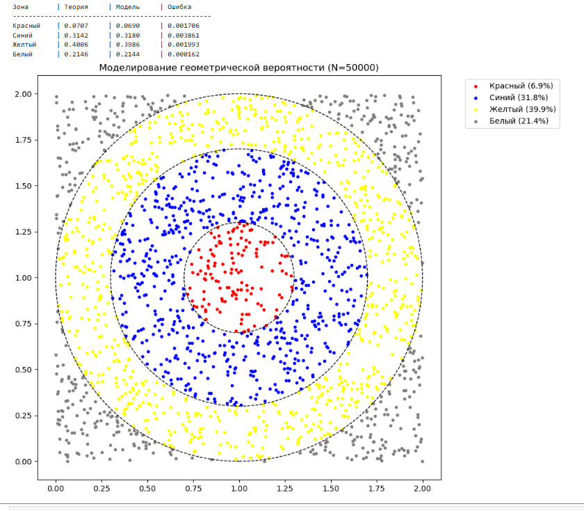
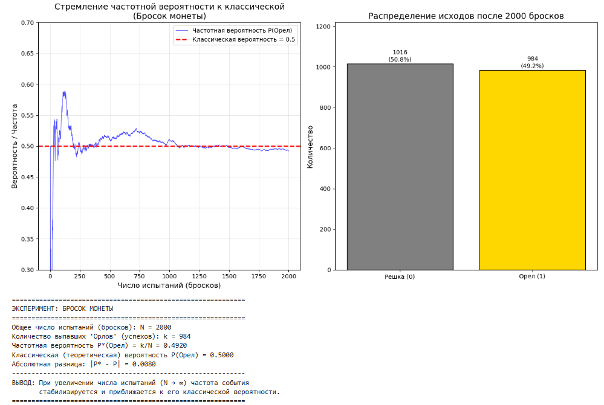
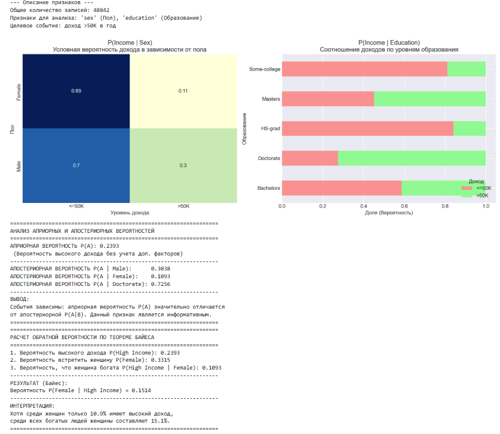
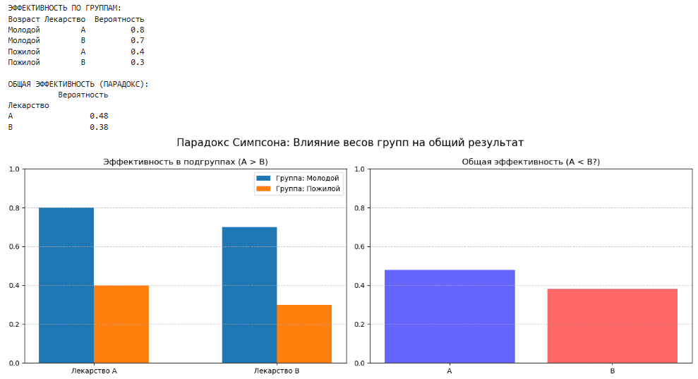
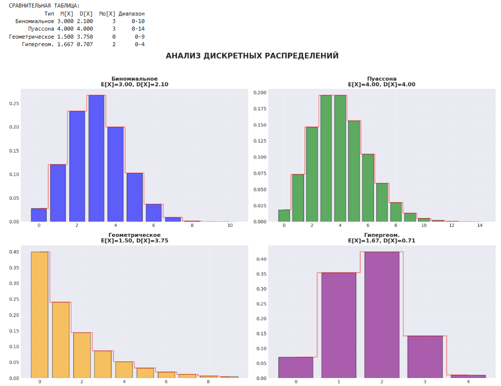
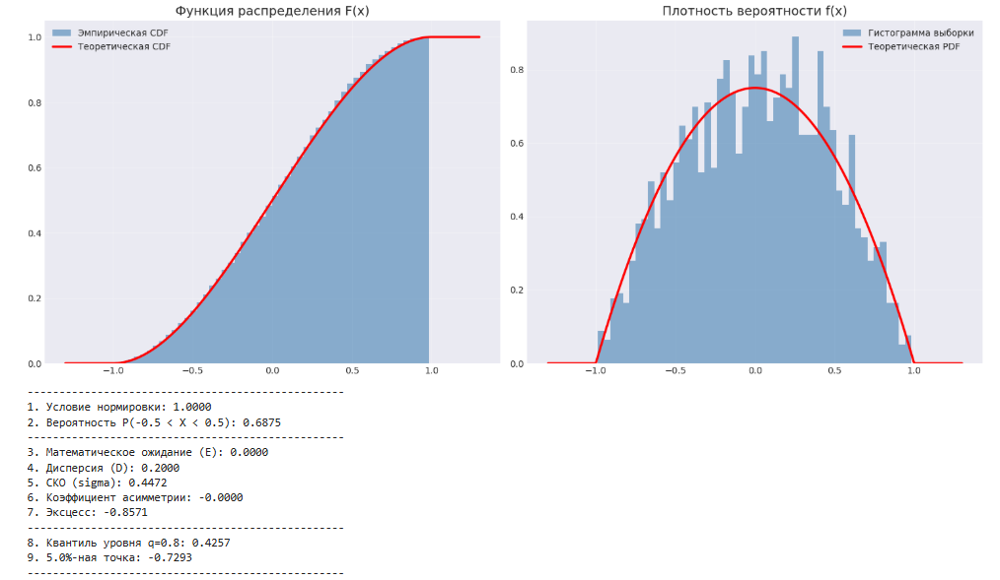
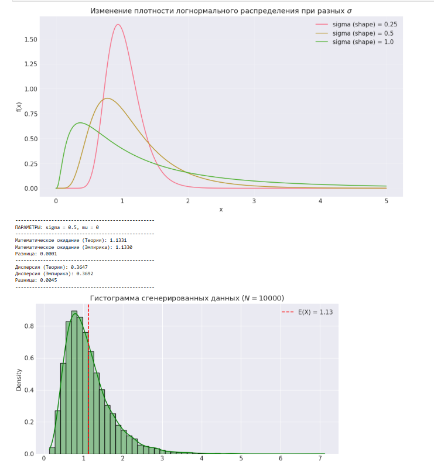

# 📊 Проект: Исследование теории вероятностей на Python

Этот репозиторий содержит **7 практических работ**, реализованных в формате Jupyter Notebook. Каждая работа включает теоретическое обоснование, программную реализацию и интерактивную визуализацию.

---

## 🎯 Обзор практических работ

### 1. Моделирование геометрической вероятности
**Файл:** `01_geometric_probability.py`
Исследование вероятности попадания в цветную мишень методом Монте-Карло. Демонстрация того, как отношение площадей определяет вероятность.

### 2. Закон больших чисел
**Файл:** `02_frequency_classical_link.py`
Демонстрация сходимости частотной вероятности к теоретической при увеличении числа испытаний (бросок монеты).

### 3. Условные вероятности (Байес)
**Файл:** `03_conditional_probabilities.py`
Анализ реального датасета (Adult Census Income). Применение формулы полной вероятности и теоремы Байеса для поиска зависимостей в данных.

### 4. Парадокс Симпсона
**Файл:** `04_probability_paradox.ipynb`
Моделирование ситуации, когда тренд в отдельных группах меняется на противоположный при их объединении.

### 5. Дискретные распределения
**Файл:** `05_discrete_distributions.py`
Анализ Биномиального, Пуассоновского, Геометрического и Гипергеометрического распределений. Расчет $M[X]$, $D[X]$ и моды.

### 6. Собственные распределения
**Файл:** `06_custom_distributions.py`
Создание класса для работы с Лемнискатным распределением: проверка нормировки и расчет характеристик.

### 7. Непрерывные распределения
**Файл:** `07_parameter_dependence.py`
Исследование влияния параметров (среднее, дисперсия) на форму кривой нормального и бета-распределений.

---

## 🛠 Инструменты и библиотеки
* **Язык:** Python 3.x
* **Библиотеки:** `numpy`, `pandas`, `scipy`, `matplotlib`, `seaborn`
